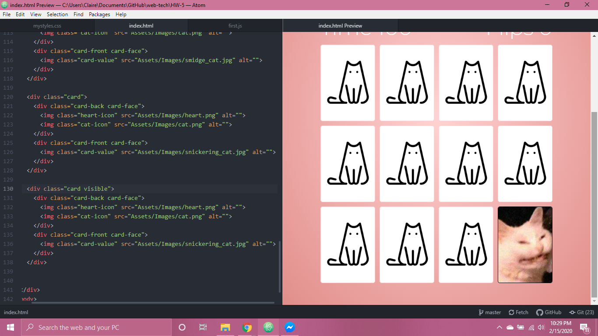
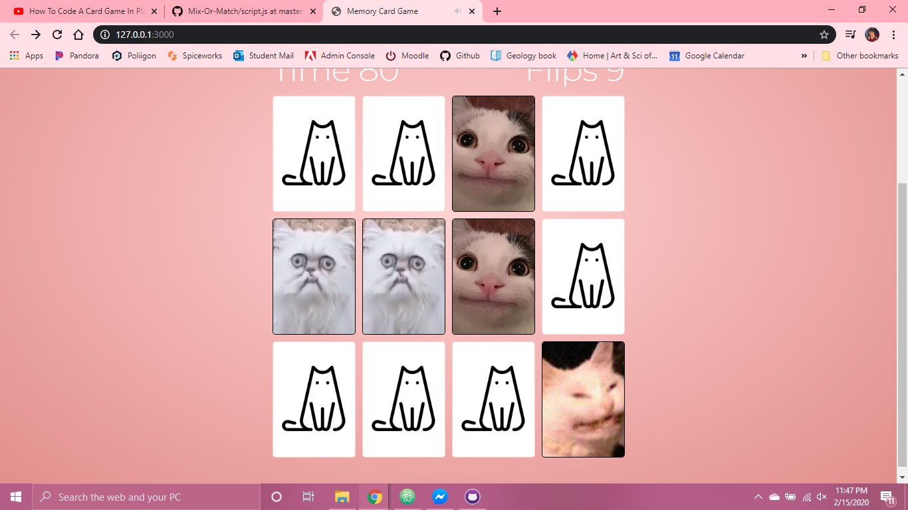

### Homework 5
I had a great a fun time creating this project for Homework 5

I referenced two tutorials:

One by my fave *Web Dev Simplified*
https://youtu.be/28VfzEiJgy4 who went over styling and

One by *PortEXE*
https://youtu.be/3uuQ3g92oPQ who went over the javascript functionality.

I used google fonts, different cursors, and also audio to this project because I had a veeerrry specific theme in mind for this project.

