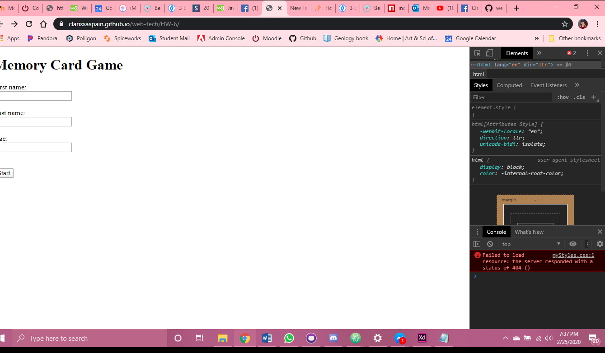
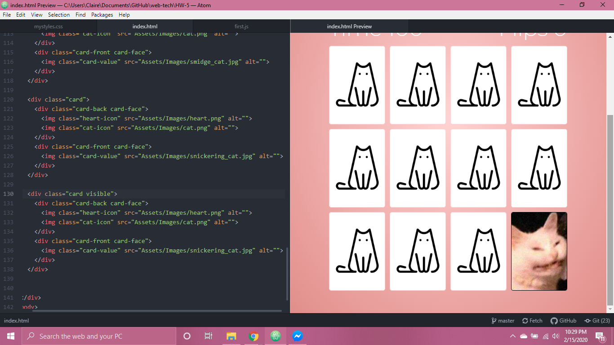

### Homework 6

I tried to add some information about name into the website, but I wasn't able to get that part to work. It sort of made my code fall apart. Maybe I was doing it wrong?

I was also having issues connecting the css to my index.html page even though it was working just fine when I started a live browser from my computer?

_

I had a great a fun time creating this project for Homework 5. I may have gotten a bit ahead of myself because I really enjoyed the process for the memory matching portion of it.

I referenced two tutorials:

One by my fave *Web Dev Simplified*
https://youtu.be/28VfzEiJgy4 who went over styling and

One by *PortEXE*
https://youtu.be/3uuQ3g92oPQ who went over the javascript functionality.

I used google fonts, different cursors, and also audio to this project because I had a veeerrry specific theme in mind for this project.
